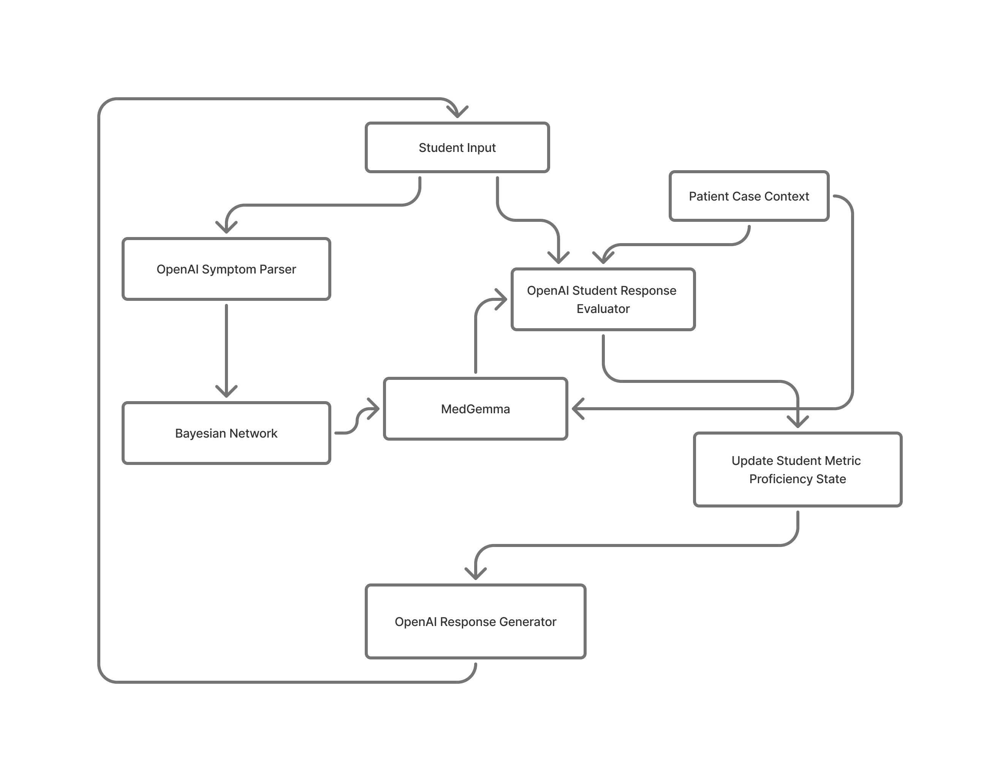

# System Diagram

This page explains the architecture shown in `../system-diagram.png`.

## Components

- Frontend (React + Firebase)
- Backend API (FastAPI)
- Core tutoring pipeline (parsing, Bayes grounding, MedGemma packeting, rubric evaluation, attending response)
- External services (OpenAI, Vertex AI MedGemma, Firebase)
- Persistence layer (Firestore user profile + completed case records)

## Data Flow

1. User signs in on the frontend via Firebase Auth.
2. Frontend sends authenticated requests to backend session endpoints.
3. Backend parses student input into structured symptoms/diagnoses.
4. Bayes engine computes grounded differential probabilities.
5. Backend builds a MedGemma prompt packet using case context + Bayes summary.
6. Evaluation workflow grades the presentation against 9 metrics and identifies gaps.
7. AI attending returns concise coaching and one targeted Socratic question.
8. Final case performance and transcript are persisted in Firestore and shown in profile analytics.

